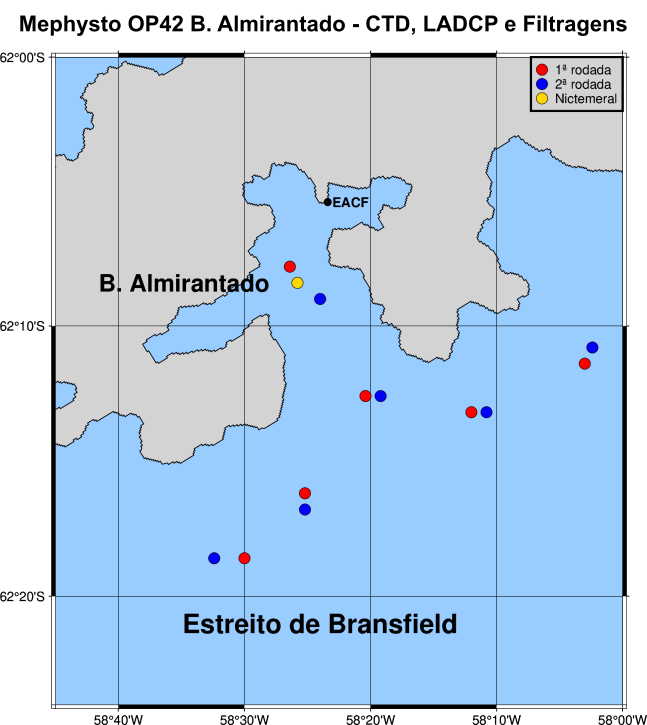

# Mephysto Operantar 42 samples maps

## Introduction  

## 1 Requirements    

### 1.1 Linux and Python
This program relies on a Python-3 interpreter and the anaconda (or miniconda) package manager. Also, it was tested and developed on Ubuntu-18-04 with the Anaconda3 environment manager but probably can be run on other Linux distributions and MacOS.  
All python packages required by the program are listed in [requirements file](installation/requirements.txt). In order to create and activate environment with all dependencies, you first need to install [anaconda 3](https://www.anaconda.com/) or miniconda on your linux machine. After, from the folder of the project, you should run:

```sh
bash installation/0_install_dependencies.sh
```

### 1.2 Activate environment
After installation, you can activate your mephysto environment with the command:

```sh
conda activate mephysto
```

## 2 Usage
With the environment properly activated and from the main folder " ~your_personal_path/mephysto " you can run each script for figures generation. 

### 2.1 - almirantado filtragens
- Collection of water filtered samples in Baia do Almirantado. This cam be generated through
```bash
python3 Python/almirantado_map_filtragens.py
```


### 2.2 - almirantado plastico
- Collection of plastic samples trajectories done in Baia do Almirantado. This cam be generated through:
```bash
python3 Python/almirantado_map_plastico.py
```


### 2.3 - drake plastico
- Collection of plastic samples trajectories done in Drake Passage. This cam be generated through:
```bash
python3 Python/drake_plastico
```


## Contributors and contact
- Leonardo Brait - leonardobrait@gmail.com
- Leonardo Bruto - leonardo.bruto@ufpe.br